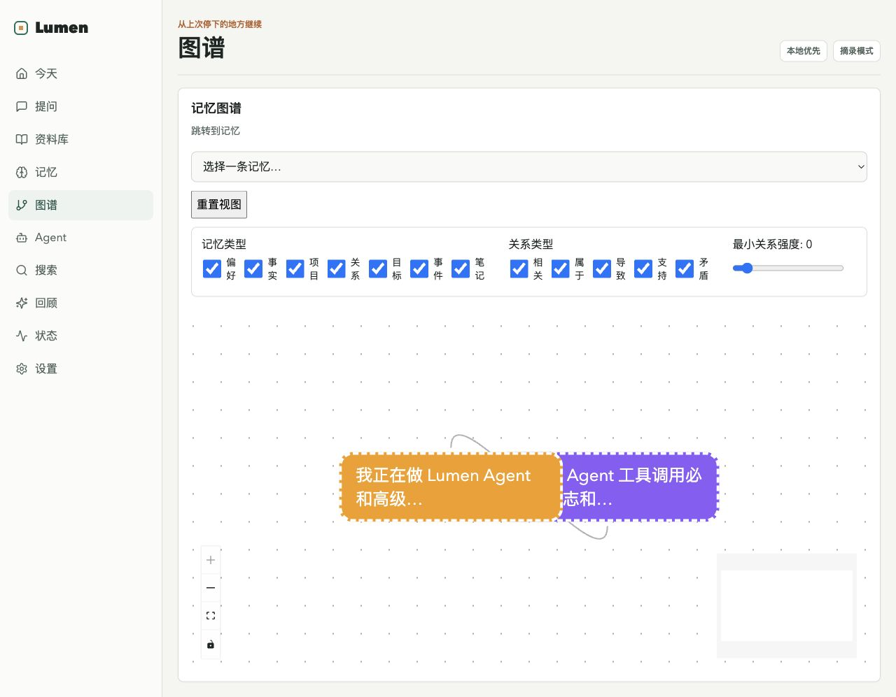

# Lumen

Lumen 是一个本地优先的个人 AI 知识库和长期记忆助手。当前版本是 Phase 1.6 原型，重点是在已有记忆基础上添加可解释的关系图谱：

```text
添加资料
-> 建立索引
-> 基于资料提问并查看引用
-> 从对话中提取待确认记忆
-> 确认、编辑、合并或遗忘记忆
-> 用标签、收藏和全局搜索找回资料、记忆和回答
-> 在今日回顾里查看最近变化和下一步建议
-> 在状态页查看运行健康并修复失败资料
-> 在记忆图谱里查看记忆关系和来源
```

## 当前能力

### 📚 资料管理
- 添加纯文本资料并自动索引
- 上传 `.txt`、`.md`、`.pdf`、`.docx`、`.epub`、图片（PNG、JPG、GIF、WebP）文件，支持**批量多选**
- 捕获网页链接并提取安全 HTML 文本；失败会留下状态与错误信息
- **深度抓取**：配置递归深度和页数上限，Playwright 抓取同域页面
- **书签导入**：粘贴浏览器导出的 Netscape HTML 书签，批量导入为链接资料
- 资料库可查看详情、索引片段数、解析错误，并删除不再需要的资料
- 失败链接可从状态页或资料入口重试

### 💬 对话与回答
- 基于已索引资料提问，回答显示引用片段和置信度
- 搜索结果和引用显示匹配原因（关键词、日期等）
- 针对中文日期做聚焦引用，如 `2026年6月1日做了什么工作？`
- 默认摘录模式，无需模型 API key
- 可启用 OpenAI-compatible LLM 流式回答（SSE），失败自动回退摘录模式
- 在设置页创建、测试、启用模型配置，配置保存在本地 SQLite

### 🧠 记忆系统
- 从对话中提取候选记忆（项目、偏好、目标等）
- 记忆收件箱中确认或忽略候选记忆
- 编辑、遗忘、合并已确认记忆
- 查看记忆来源和重复记忆合并建议
- 记忆之间创建有向关系：相关、属于、导致、支持、矛盾、合并入
- 合并记忆自动创建「合并入」关系，保留血统
- 重复建议旁可「标记为相关」转为 `related_to` 关系

### 🕸️ 记忆图谱（Phase 1.6 新增）
- 增量探索式网络：从枢纽记忆出发，双击展开邻居，逐步探索
- React Flow + d3-force 力导向布局，支持缩放、平移、拖拽、minimap
- 节点按记忆类型配色（项目/偏好/事实/关系/目标/事件/笔记）
- 单击节点查看详情，双击展开/收起邻居
- 按记忆类型、关系类型、关系强度即时过滤
- 搜索跳转到任意记忆作为探索起点
- 遗忘的记忆和关系不会出现在图谱中

### 🔍 组织与发现
- 全局搜索：同时检索资料片段、资料记录、记忆和对话回答
- 支持按结果类型、标签、收藏状态筛选
- 为资料、记忆、回答收藏，方便后续找回
- 本地标签建议，可确认转为正式标签或忽略
- 今日回顾展示最近变化和下一步建议
- 状态页展示运行健康、失败资料、待确认标签和修复动作

### 🖥️ 界面
- 完整中文工作台界面（按钮、文案、空状态、状态标签、兜底回答）
- 左侧导航切换：今天、提问、资料库、记忆、图谱、搜索、回顾、状态、设置
- 模型 API key 本地存储，读取接口仅返回是否已配置，不返回明文

## 当前限制

- 现在是本地原型，不是完整生产应用。
- 默认回答模式仍是摘录式，不需要模型 API key；LLM 总结是可选能力。
- Phase 1.5 的模型配置仍只支持 OpenAI-compatible 聊天接口。
- SQLite 中保存的 API key 是本机明文存储，依赖本机文件权限保护；暂未接入系统 keychain 或加密密钥库。
- PDF 支持 selectable-text 提取和 Tesseract OCR 扫描件回退；OCR 质量取决于系统 Tesseract 安装和语言包。
- 网页抓取支持 JS 渲染和递归爬取，但登录页和反爬机制未做特殊处理。
- Agent 配置 UI、外部 reranker 配置和完整任务队列面板仍未实现。
- 标签建议是本地确定性启发式建议，不会默认调用 LLM 自动打标签。
- 后端 API 的置信度字段仍使用内部枚举，例如 `grounded`、`memory-only`、`weak`；前端会显示为中文。
- 数据默认写入后端目录下的本地 SQLite 数据库 `backend/lumen.db`。

## Phase 1.6: 记忆图谱可视化

> **新增「图谱」视图**：在记忆网络中可视化探索关系。


<!-- TODO: 替换为实际截图。建议尺寸 1200×700，展示 5-8 个节点和关系边，minimap 和控制按钮可见 -->

### 核心交互

| 操作 | 效果 |
|------|------|
| 🖱️ 单击节点 | 选中并显示记忆详情（文本、类型） |
| 🖱️🖱️ 双击节点 | 展开邻居（累积到当前图）或收起已展开的节点 |
| 🔍 搜索下拉 | 跳转到任意记忆，自动展开为探索起点 |
| 🎛️ 过滤器 | 按记忆类型、关系类型、关系强度即时过滤 |
| 🔄 重置按钮 | 恢复初始枢纽视图 |
| 🖐️ 拖拽/滚轮 | 平移画布、缩放视图 |

### 技术实现
- **布局**：d3-force 力导向模拟，关系强度影响边距离
- **渲染**：React Flow 提供画布、minimap、缩放控制
- **增量探索**：`mergeGraphs`/`collapseNode` 纯函数管理图状态
- **客户端过滤**：`applyFilters` 即时派生可见子图

## Phase 1.7: 资料摄取扩展

> **新增「书签导入」「批量上传」「深度抓取」**：资料来源从 3 种扩展到 10 种，通过模块化 Parser Registry 统一处理。

### 新增能力

| 来源 | 支持格式 | 说明 |
|------|----------|------|
| 文本 | `.txt`、`.md` | 纯文本直接索引 |
| PDF | `.pdf` | pypdf 提取文本，扫描件自动回退到 Tesseract OCR |
| Word | `.docx` | python-docx 提取段落和表格 |
| EPUB | `.epub` | ebooklib 提取章节内容 |
| 图片 | `.png`、`.jpg`、`.jpeg`、`.gif`、`.webp` | Tesseract OCR 提取文本，可选 AI 视觉描述 |
| 链接 | URL | httpx + BeautifulSoup 提取正文 |
| 深度抓取 | URL + 配置 | Playwright 递归抓取同域页面，支持 JS 渲染 |
| 书签 | Netscape HTML | 批量导入浏览器书签为链接资料 |

### 核心交互

| 操作 | 效果 |
|------|------|
| 📎 文件 tab | 支持多选，一次上传多个 TXT/PDF/DOCX/EPUB/图片 |
| 🔗 链接 tab | 勾选「深度抓取」，配置递归深度（1-3）和页数上限（1-50） |
| 🔖 书签 tab | 粘贴浏览器导出的 HTML 书签，批量导入 |
| 🔄 重试 | 解析失败的资料可在状态页或资料详情处重试 |

### 技术实现
- **Parser Registry**：`ContentParser` Protocol + `register_parser()`/`get_parser()`，新增 parser 无需修改 API 层
- **文件存储**：`save_temp_upload()` → 解析成功 → `move_to_final()`，防止未索引文件堆积
- **PDF 双轨**：先 pypdf 文本提取，失败时 PyMuPDF 渲染 + Tesseract OCR
- **图片双通道**：Tesseract OCR 提取可见文字，可选 LLM Vision 描述图片内容
- **爬取控制**：BFS 队列，同域过滤，超时跳过，页数和深度硬上限

## 环境要求

- Python 3.12+
- uv
- Node.js 和 npm

## 启动后端

```bash
cd backend
uv sync
uv run uvicorn service.main:app --host 127.0.0.1 --port 8000 --reload
```

健康检查：

```bash
curl -s http://127.0.0.1:8000/healthz
```

期望返回：

```json
{"status":"ok"}
```

## 启动前端

```bash
cd frontend
npm install
npm run dev
```

前端默认调用：

```text
http://127.0.0.1:8000
```

如果后端地址不同，可以设置 `VITE_API_BASE`。

打开：

```text
http://127.0.0.1:5173/
```

## 可选 LLM 回答

默认不需要模型配置：

```bash
LUMEN_LLM_MODE=extractive
```

如果要启用 OpenAI-compatible 聊天模型，推荐在「设置」视图创建模型配置，填写 Base URL、模型名和 API key，然后点击「测试连接」和「设为当前」。

也可以在启动后端前使用环境变量作为 fallback 配置：

```bash
export LUMEN_LLM_MODE=llm
export LUMEN_LLM_PROVIDER=openai-compatible
export LUMEN_LLM_BASE_URL=https://api.openai.com/v1
export LUMEN_LLM_MODEL=<model-name>
export LUMEN_LLM_API_KEY=<api-key>
export LUMEN_LLM_FALLBACK_ENABLED=true
```

当存在已启用的 SQLite 模型配置时，Lumen 会优先使用它；否则使用环境变量。API key 不会通过读取接口返回。模型请求失败或证据不足时，回答会回退到摘录模式。

## 使用流程

### 基础用法
1. 在「询问或记录」输入框粘贴资料，点击「添加资料」自动索引
2. 或切到「文件」/`链接` 上传文档或添加网页
   - **文件**：支持批量多选 TXT、PDF、DOCX、EPUB、图片
   - **链接**：勾选「深度抓取」可递归抓取同域页面
   - **书签**：粘贴浏览器导出的 HTML 书签批量导入
3. 输入问题，点击「询问 Lumen」，查看流式回答和引用片段
4. 右侧「记忆收件箱」出现候选记忆时，「确认」或「忽略」
5. 进入「记忆」视图管理已确认记忆，编辑/遗忘/合并

### 发现与组织
6. 「搜索」视图全局检索，按类型/标签/收藏筛选
7. 在资料、记忆、回答旁点击收藏或确认标签建议
8. 「状态」视图查看运行健康、重试失败资料
9. 「今日回顾」查看最近变化和建议动作

### 🕸️ 图谱探索（Phase 1.6 新增）
10. 进入「图谱」视图，从枢纽记忆开始探索关系网络
11. **单击节点**查看记忆详情
12. **双击节点**展开邻居（累积）或收起已展开的分支
13. 使用过滤器收窄范围（类型/关系/强度）
14. 搜索下拉跳转到任意记忆作为新起点
15. 在记忆详情或重复建议旁点击「添加关系」，建立有向连接
16. 「设置」视图管理模型配置

可以用下面的资料做烟测：

```text
Lumen 是一个本地优先的个人 AI 知识库，用来保存资料、检索知识，并通过确认机制记住用户偏好。
```

添加资料后提问：

```text
Lumen 是什么？
```

也可以添加工作日报后提问：

```text
2026年6月1日，我完成了 Lumen 中文化界面、日期检索和记忆收件箱烟测。
```

```text
2026年6月1日做了什么工作？
```

触发记忆候选可以输入：

```text
我喜欢用中文记录项目目标，Lumen 项目的目标是做成本地优先的个人知识库。
```

期望「记忆收件箱」出现候选记忆，可以点击「确认」或「忽略」。

确认后进入「记忆」视图，可以修改记忆内容、将临时记忆遗忘，或把两条相关记忆合并。

## 测试和验收

后端：

```bash
cd backend
uv run pytest -v
```

前端：

```bash
cd frontend
npm run test
npm run build
```

端到端烟测：

1. 启动后端和前端。
2. 打开 `http://127.0.0.1:5173/`。
3. 添加一条中文资料。
4. 提问并确认回答有中文内容、引用片段和置信度。
5. 输入一句包含「项目」「喜欢」「目标」等关键词的话，确认记忆收件箱出现候选记忆。
6. 点击「确认」或「忽略」，确认界面刷新正常。

**Phase 1.7 新增烟测：**

7. 切换「文件」tab，选择多个 `.txt` 文件同时上传，确认批量导入成功。
8. 切换「链接」tab，勾选「深度抓取」，输入一个博客 URL，确认递归抓取状态。
9. 切换「书签」tab，粘贴一段 Netscape HTML 书签内容，点击「导入书签」，确认结果统计。
10. 上传一个 `.docx` 或 `.pdf` 文件，确认解析和索引成功。
11. 在「资料库」查看所有新添加的资料，确认类型和状态正确。
